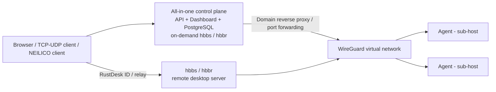

**English** | [简体中文](README.zh-CN.md)

# NEILICO

NEILICO is a self-hosted control plane for NAT traversal, WireGuard mesh networking, domain reverse proxying, TCP/UDP port forwarding, and remote desktop access. One all-in-one container combines the API, Dashboard, PostgreSQL, and RustDesk `hbbs`/`hbbr`, while agents on sub-hosts apply the generated WireGuard configuration.

It centralizes service publication, virtual networking, devices, policies, proxy and stream rules, and remote-desktop connection parameters. Remote connections are initiated by the NEILICO client; the web UI is for management only.

## Architecture



- The control-plane container provides the API, Dashboard, and PostgreSQL. The control plane starts `hbbs` and `hbbr` on demand, so no remote-desktop ports are listened on while the service is inactive.
- Agents enroll, send heartbeats, and receive versioned configuration. When platform support and privileges are available, they apply `wg0`, routes, and subnet forwarding.
- The domain reverse proxy handles HTTP/HTTPS, while stream rules publish explicit TCP/UDP ports. Both resolve targets to node virtual IPs or configured addresses.
- The RustDesk server supplies ID and relay service. Connections are always initiated by the separate [NEILICO client](https://github.com/aceneil/neilico-client).

## Repository layout

| Path | Purpose |
| :-- | :-- |
| `control-plane/` | Go API, authentication and authorization, tenants, nodes, networks, rules, metrics, and remote-desktop control |
| `agent/` | Sub-host agent, capability detection, WireGuard setup, routing, and forwarding |
| `dashboard/` | Vue 3 Dashboard |
| `third_party/rustdesk-server/` | Vendored RustDesk Server `hbbs`/`hbbr` (AGPL-3.0) |
| `deploy/` | All-in-one, agent, Compose, and Helm deployment files |
| [`docs/`](docs/README.md) | Specifications, enrollment, operations, remote desktop, and network-boundary documentation |
| `cli/` | `neilicoctl` command-line tool |
| `scripts/` | Smoke, TLS, verification, and operations scripts |

The Flutter device-management app, formerly under `desktop/`, and the `rust-core/` skeleton have moved to [`app/`](https://github.com/aceneil/neilico-client/tree/neilico/app) in [aceneil/neilico-client](https://github.com/aceneil/neilico-client). The old directories remain here temporarily to support migration.

## Quick start

Use the reference Compose file [`deploy/allinone/docker-compose.yml`](deploy/allinone/docker-compose.yml) and environment template [`deploy/allinone/.env.example`](deploy/allinone/.env.example). Point the Compose `env_file` and persistent volumes at a data directory of your choice before starting.

```bash
cd deploy/allinone
cp .env.example <your-data-root>/neilico.env
# Generate and replace POSTGRES_PASSWORD, NEILICO_AUTH_JWT_SECRET,
# NEILICO_BOOTSTRAP_ADMIN_EMAIL, and NEILICO_BOOTSTRAP_ADMIN_PASSWORD.
chmod 600 <your-data-root>/neilico.env
docker compose up -d --build
curl -fsS http://127.0.0.1:13000/healthz
```

Open `http://127.0.0.1:13000/` for the Dashboard and API. The built-in reverse proxy listens on `18081` by default.

For the first login, either configure `NEILICO_BOOTSTRAP_ADMIN_*`, or leave them unset and use **First use? Register**. That form calls `GET /api/v1/setup/status`; when `registration_open=true`, the first account becomes the platform administrator and is signed in automatically. Later attempts return `409 already_initialized`. A configured bootstrap password must be at least 16 characters and contain at least three of four character classes.

## Enrolling sub-hosts

Create a one-time enroll token in the Dashboard, then use the Linux/macOS or Windows installer:

```bash
curl -fsSL https://<SERVER>/install.sh | sudo bash -s -- --token <TOKEN>
```

```powershell
powershell -ExecutionPolicy Bypass -Command "& ([scriptblock]::Create((irm https://<SERVER>/install.ps1))) -Token <TOKEN>"
```

The installers download the matching agent, verify SHA-256, install a service, and store the one-time credentials. They also support `--name`, `--server`, and `--dry-run`. A Docker agent can run directly or through the Compose example in [`deploy/agent/README.md`](deploy/agent/README.md):

```bash
docker run -d --network host --cap-add NET_ADMIN --device /dev/net/tun \
  -v neilico-agent-state:/var/lib/neilico-agent \
  -e NEILICO_TOKEN=<TOKEN> ghcr.io/aceneil/neilico-agent:latest
```

Real WireGuard operation requires `NET_ADMIN` or equivalent administrator rights, `/dev/net/tun`, and kernel or system WireGuard support. If any requirement is missing, the agent reports `mesh`, `subnet_routes`, or `tunnel` as unavailable instead of claiming connectivity.

## Remote desktop

RustDesk `hbbs` for ID/signaling and `hbbr` for relay are compiled into the all-in-one image and started by the control plane on demand. The default `on_demand` mode starts them only when needed and stops them after `NEILICO_RD_IDLE_TIMEOUT` of inactivity. `always_on` and `off` are also supported. The ports are `21115-21119`, with `21116` used over both TCP and UDP; it is normal for nothing to listen while the service is disabled.

`hbbr` starts with `-k _` for RustDesk protocol-key validation. This is not a NEILICO account or device allowlist. By default, the ID/relay endpoint accepts registration from any client that can reach it. Public deployments must restrict exposure and source access. Encryption is provided by the RustDesk protocol. The web UI manages devices and policies but exposes no connection entry point. Download and platform status for the separate client are documented in [aceneil/neilico-client](https://github.com/aceneil/neilico-client).

## Configuration quick reference

| Variable | Purpose |
| :-- | :-- |
| `POSTGRES_PASSWORD`, `NEILICO_AUTH_JWT_SECRET` | Required database and JWT secrets; keep them only in a protected environment file |
| `NEILICO_BOOTSTRAP_ADMIN_EMAIL` / `_PASSWORD` | Initial administrator; omit both to use first-run registration |
| `NEILICO_SERVER_PORT` | Control-plane API/Dashboard port; Compose publishes it as `13000` |
| `NEILICO_PROXY_LISTEN` | Built-in reverse-proxy listener; Compose publishes it as `18081` |
| `NEILICO_RD_ENABLED`, `NEILICO_RD_ID_SERVER`, `NEILICO_RD_RELAY_SERVER` | Remote-desktop switch and advertised server addresses |
| `NEILICO_RD_SERVER_MODE`, `NEILICO_RD_IDLE_TIMEOUT` | `on_demand`/`always_on`/`off` lifecycle and idle shutdown |
| `NEILICO_RD_KEY_DIR`, `NEILICO_RD_PUBLIC_KEY_FILE` | Server key directory and read-only public-key path; the private key does not leave the key directory |
| `NEILICO_RD_PORTS`, `NEILICO_RD_RELAY_PORT`, `NEILICO_RD_UDP_PORT` | hbbs/hbbr listening and health-check ports |
| `NEILICO_RD_RELAY_HOST` | Explicit relay host passed to `hbbs -r` |
| `RUSTDESK_RELAY_HOST` | Relay hostname used by public deployments and clients; the control plane reads `NEILICO_RD_RELAY_HOST`, so automation must map the two names |
| `NEILICO_DOWNLOADS_DIR` | Artifact directory served by `/downloads/...`, `install.sh`, and `install.ps1` |
| `NEILICO_STREAM_PORT_MIN` / `_MAX` | Allowed TCP/UDP range for published stream rules |

## Documentation

Start with the bilingual [documentation index](docs/README.md). The main references are the [Control API](docs/API.md), [agent enrollment](docs/AGENT_ENROLL.md), [operations guide](docs/OPS.md), [remote-desktop integration](docs/REMOTE_DESKTOP.md), [public deployment checklist](docs/DEPLOY_PUBLIC.md), and [NEILICONET feasibility analysis](docs/NEILICONET.md).

## Honest limitations

- Control-plane TLS and mTLS are disabled by default, so the default LAN HTTP endpoint is plaintext. Read [`docs/OPS.md`](docs/OPS.md) before enabling TLS or mTLS. A public entry point must terminate TLS elsewhere or explicitly enable it.
- There is no built-in P2P hole punching. WireGuard cannot establish a path when both NAT endpoints are unreachable. See [`docs/NEILICONET.md`](docs/NEILICONET.md) and [`docs/DEPLOY_PUBLIC.md`](docs/DEPLOY_PUBLIC.md) for boundaries and reachability requirements.
- `/metrics` has no real collection for `neilico_p2p_success_rate` or `neilico_relay_bytes`; both metrics are always `0`.
- Agent capabilities are downgraded honestly based on platform support and privileges. Full Mesh capability on Windows and macOS must be determined by runtime detection.
- `third_party/rustdesk-server` is **AGPL-3.0**; see [`third_party/rustdesk-server/LICENSE`](third_party/rustdesk-server/LICENSE).

## License

The root [`LICENSE`](LICENSE) remains a placeholder and the **root-repository license is pending**. This README does not select a license on the owner's behalf. Third-party RustDesk Server source and vendored Cargo dependencies retain their own licenses; see [`NOTICE`](NOTICE) and `third_party/rustdesk-server/`.
