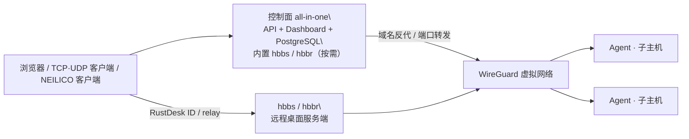

# NEILICO

NEILICO 是一套自托管的内网穿透、Mesh 组网、域名反向代理、TCP/UDP 端口转发和远程桌面控制面；它把 API、Dashboard、PostgreSQL 与 RustDesk 服务端（`hbbs`/`hbbr`）放进一个 all-in-one 容器，并用子主机 Agent 应用 WireGuard 配置。

**解决什么问题**：把分散在内网的服务发布成域名或端口入口，把设备组成 WireGuard 虚拟网络，并集中管理设备、策略、代理规则、端口转发和远程桌面接入参数。远程连接本身由 NEILICO 客户端发起，Web 只负责管理。

## 架构



- 控制面单容器提供 API、Dashboard、PostgreSQL；`hbbs`/`hbbr` 由控制面按需拉起，无活动时不监听远程桌面端口。
- Agent 在子主机注册、心跳、领取版本化配置，并在具备权限和 WireGuard 能力时应用 `wg0`、路由和子网转发。
- 域名反代处理 HTTP/HTTPS；端口转发发布显式的 TCP/UDP 端口。两者都把目标解析到节点虚拟 IP 或指定地址。
- 远程桌面服务端提供 RustDesk ID/中继；客户端连接一律由 [NEILICO client](https://github.com/aceneil/neilico-client) 发起。

## 目录结构

| 目录 | 用途 |
| :-- | :-- |
| `control-plane/` | Go API、认证授权、租户/节点/网络/规则/指标/远程桌面控制 |
| `agent/` | 子主机 Agent、能力探测、WireGuard 应用、路由与转发 |
| `dashboard/` | Vue 3 Dashboard |
| `third_party/rustdesk-server/` | vendored RustDesk Server `hbbs`/`hbbr`（AGPL-3.0） |
| `deploy/` | all-in-one、Agent、Compose、Helm 部署 |
| `docs/` | 规格、接入、运维、远程桌面和网络边界说明 |
| `cli/` | `neilicoctl` 命令行 |
| `scripts/` | 冒烟、TLS、验证和运维脚本 |

Flutter 设备管理端（原 `desktop/`）和 `rust-core/` 已迁移到 [aceneil/neilico-client](https://github.com/aceneil/neilico-client) 的 `app/`；本仓库保留原目录以便过渡，后续可在迁移和构建验收完成后再删除。

## 快速开始

参考 Compose 是 [`deploy/allinone/docker-compose.yml`](deploy/allinone/docker-compose.yml)，环境变量模板是 [`deploy/allinone/.env.example`](deploy/allinone/.env.example)。数据目录由 Compose 的 `env_file`/挂载配置决定，请使用你选定的持久化路径。

```bash
cd deploy/allinone
cp .env.example <your-data-root>/neilico.env
# 生成并替换 POSTGRES_PASSWORD、NEILICO_AUTH_JWT_SECRET、
# NEILICO_BOOTSTRAP_ADMIN_EMAIL、NEILICO_BOOTSTRAP_ADMIN_PASSWORD
chmod 600 <your-data-root>/neilico.env
docker compose up -d --build
curl -fsS http://127.0.0.1:13000/healthz
```

访问 `http://127.0.0.1:13000/`（Dashboard + API）。内置反代默认在 `18081`。若未配置 bootstrap 管理员，登录页的「首次使用？注册」会请求 `GET /api/v1/setup/status`；`registration_open=true` 时创建第一个平台管理员并自动登录。系统已有账号后，再次注册会得到 `409 already_initialized`。配置了 `NEILICO_BOOTSTRAP_ADMIN_*` 时会直接种入管理员，密码仍须满足至少 16 字符且包含四类字符中的至少三类。

## 子主机接入

在 Dashboard 创建一次性 enroll token 后，Linux/macOS 和 Windows 都可一行接入：

```bash
curl -fsSL https://<SERVER>/install.sh | sudo bash -s -- --token <TOKEN>
```

```powershell
powershell -ExecutionPolicy Bypass -Command "& ([scriptblock]::Create((irm https://<SERVER>/install.ps1))) -Token <TOKEN>"
```

脚本会按架构下载 Agent、校验 SHA-256、安装服务并保存一次性凭据；可加 `--name`、`--server` 和 `--dry-run`。Docker Agent 也可直接运行或使用 [`deploy/agent/README.md`](deploy/agent/README.md) 的 Compose：

```bash
docker run -d --network host --cap-add NET_ADMIN --device /dev/net/tun \
  -v neilico-agent-state:/var/lib/neilico-agent \
  -e NEILICO_TOKEN=<TOKEN> ghcr.io/aceneil/neilico-agent:latest
```

真实 WireGuard 需要 `NET_ADMIN`（或等价管理员权限）、`/dev/net/tun` 和内核/系统 WireGuard 支持；缺少任一项时 Agent 会如实上报 `mesh`、`subnet_routes` 或 `tunnel` 不可用，不会伪造已连通。

## 远程桌面

服务端 `hbbs`（ID/信令）和 `hbbr`（中继）已编译进 all-in-one，并由控制面按需启动：`on_demand`（默认）无活动不启，空闲超过 `NEILICO_RD_IDLE_TIMEOUT` 回收；也支持 `always_on` / `off`。端口为 `21115-21119`（`21116` 同时 TCP/UDP），未启用时不监听是正常的。

`hbbr` 启动使用 `-k _` 做 RustDesk 协议 Key 校验；这不是 NEILICO 账号/设备白名单。ID/中继入口当前默认接受能到达服务端的客户端注册，公网部署必须自行限制暴露面和访问来源。加密由 RustDesk 协议负责；Web 只管理设备与策略，不提供连接入口。客户端下载与平台状态见 [NEILICO client](https://github.com/aceneil/neilico-client)。

## 配置速查

| 变量 | 作用 |
| :-- | :-- |
| `POSTGRES_PASSWORD`、`NEILICO_AUTH_JWT_SECRET` | 数据库和 JWT 必填秘密；只放在受保护 env 文件 |
| `NEILICO_BOOTSTRAP_ADMIN_EMAIL` / `_PASSWORD` | 首个管理员；未配置则走首次注册 |
| `NEILICO_SERVER_PORT` | 容器 API/Dashboard 端口；Compose 映射为 `13000` |
| `NEILICO_PROXY_LISTEN` | 内置反代监听；Compose 映射为 `18081` |
| `NEILICO_RD_ENABLED`、`NEILICO_RD_ID_SERVER`、`NEILICO_RD_RELAY_SERVER` | 远程桌面总开关和下发地址 |
| `NEILICO_RD_SERVER_MODE`、`NEILICO_RD_IDLE_TIMEOUT` | `on_demand`/`always_on`/`off` 与空闲回收 |
| `NEILICO_RD_KEY_DIR`、`NEILICO_RD_PUBLIC_KEY_FILE` | 服务端密钥目录与只读公钥路径；私钥不出目录 |
| `NEILICO_RD_PORTS`、`NEILICO_RD_RELAY_PORT`、`NEILICO_RD_UDP_PORT` | hbbs/hbbr 探活与监听端口 |
| `NEILICO_RD_RELAY_HOST` | 传给 `hbbs -r` 的显式中继主机 |
| `RUSTDESK_RELAY_HOST` | 公网部署/客户端侧使用的中继主机名；控制面实际读取 `NEILICO_RD_RELAY_HOST`，自动化时请映射两者 |
| `NEILICO_DOWNLOADS_DIR` | `/downloads/...` 与 `install.sh`/`install.ps1` 的产物目录 |
| `NEILICO_STREAM_PORT_MIN` / `_MAX` | 端口转发规则允许发布的 TCP/UDP 端口区间 |

## 诚实限制

- 控制面 TLS/mTLS 默认关闭；默认 LAN 访问是明文 HTTP。启用 TLS/mTLS 前阅读 [`docs/OPS.md`](docs/OPS.md)，公网入口必须自行终止 TLS 或显式开启。
- 当前没有自带 P2P 打洞；NAT 两端都不可达时 WireGuard 建不起来。边界、端口转发和可达性条件见 [`docs/NEILICONET.md`](docs/NEILICONET.md) 与 [`docs/DEPLOY_PUBLIC.md`](docs/DEPLOY_PUBLIC.md)。
- `/metrics` 的 `neilico_p2p_success_rate` 和 `neilico_relay_bytes` 当前没有真实采集，恒为 0。
- Agent 能力会按平台和权限如实降级；Windows/macOS 的完整 Mesh 能力需以运行时探测结果为准。
- `third_party/rustdesk-server` 是 **AGPL-3.0**，原文见 [`third_party/rustdesk-server/LICENSE`](third_party/rustdesk-server/LICENSE)。

## 许可

根目录 [`LICENSE`](LICENSE) 仍为占位文件，**许可待定**，本 README 不替用户选择许可。第三方 RustDesk Server 源码及 vendored Cargo 依赖保留各自许可，见 [`NOTICE`](NOTICE) 和 `third_party/rustdesk-server/`。

---

# English

NEILICO is a self-hosted control plane for NAT traversal, WireGuard mesh networking, domain reverse proxying, TCP/UDP port forwarding, and remote desktop access. An all-in-one container combines API, Dashboard, PostgreSQL, and RustDesk `hbbs`/`hbbr`; agents on sub-hosts apply the generated WireGuard configuration.

It centralizes service publication, virtual networking, devices, policies, proxy rules, stream rules, and remote-desktop connection parameters. Remote connections are initiated by the NEILICO client; the web UI is management-only.

## Architecture

The diagram above is the deployment model: one control-plane container with API, Dashboard, PostgreSQL, and on-demand `hbbs`/`hbbr`; a WireGuard virtual network; and agent-enrolled sub-hosts. The built-in reverse proxy handles HTTP/HTTPS and explicit TCP/UDP stream rules. The RustDesk server handles ID/relay traffic, while the separate client repository contains all client apps.

## Layout

`control-plane/`, `agent/`, `dashboard/`, `third_party/rustdesk-server/`, `deploy/`, `docs/`, `cli/`, and `scripts/` hold the server, agent, web UI, vendored RustDesk server, deployment files, documentation, CLI, and scripts. The former `desktop/` Flutter management app and `rust-core/` skeleton have moved to the `app/` directory in [aceneil/neilico-client](https://github.com/aceneil/neilico-client); the old paths remain temporarily for migration safety.

## Quick start

Use [`deploy/allinone/docker-compose.yml`](deploy/allinone/docker-compose.yml) and [`deploy/allinone/.env.example`](deploy/allinone/.env.example). Choose a persistent data root, copy the template there, replace `POSTGRES_PASSWORD`, `NEILICO_AUTH_JWT_SECRET`, `NEILICO_BOOTSTRAP_ADMIN_EMAIL`, and `NEILICO_BOOTSTRAP_ADMIN_PASSWORD`, then run:

```bash
cd deploy/allinone
docker compose up -d --build
curl -fsS http://127.0.0.1:13000/healthz
```

Open `http://127.0.0.1:13000/`. The built-in proxy listens on `18081`. Without bootstrap admin variables, use “First use? Register”; the first account becomes the platform administrator. After initialization, registration returns `409 already_initialized`.

## Enrolling sub-hosts

Create an enroll token, then use the one-line installer:

```bash
curl -fsSL https://<SERVER>/install.sh | sudo bash -s -- --token <TOKEN>
```

```powershell
powershell -ExecutionPolicy Bypass -Command "& ([scriptblock]::Create((irm https://<SERVER>/install.ps1))) -Token <TOKEN>"
```

Docker agents need `NET_ADMIN`, `/dev/net/tun`, and host networking or equivalent access. Missing WireGuard/TUN/privileges are reported honestly as unavailable or degraded.

## Remote desktop

RustDesk `hbbs`/`hbbr` are built into the image and started on demand by default. `hbbr` uses `-k _` for RustDesk protocol-key validation, but there is no NEILICO account/device allowlist for ID/relay registration; restrict public exposure and source access. Encryption is provided by the RustDesk protocol. Ports are `21115-21119`, with `21116` TCP+UDP. Clients come from [aceneil/neilico-client](https://github.com/aceneil/neilico-client).

## Configuration

Set `POSTGRES_PASSWORD`, `NEILICO_AUTH_JWT_SECRET`, `NEILICO_BOOTSTRAP_ADMIN_EMAIL`, `NEILICO_BOOTSTRAP_ADMIN_PASSWORD`, `NEILICO_SERVER_PORT` (published as `13000`), `NEILICO_PROXY_LISTEN` (published as `18081`), `NEILICO_RD_*`, `NEILICO_DOWNLOADS_DIR`, and `NEILICO_STREAM_PORT_MIN`/`_MAX`. `RUSTDESK_RELAY_HOST` is the deployment/client-side relay name; the control plane reads the equivalent `NEILICO_RD_RELAY_HOST` and passes it to `hbbs -r`.

## Honest limitations

TLS and mTLS are disabled by default, so the default LAN HTTP is plaintext. There is no built-in P2P hole punching; see [`docs/NEILICONET.md`](docs/NEILICONET.md). `neilico_p2p_success_rate` and `neilico_relay_bytes` are always zero because real collection is not connected. Agent capabilities are downgraded honestly when platform support or privileges are missing. The vendored `third_party/rustdesk-server` is **AGPL-3.0**.

## License

The root [`LICENSE`](LICENSE) is a placeholder and **the license is pending**; no license is selected here. Third-party RustDesk Server and vendored dependencies retain their own licenses; see [`NOTICE`](NOTICE) and `third_party/rustdesk-server/`.
