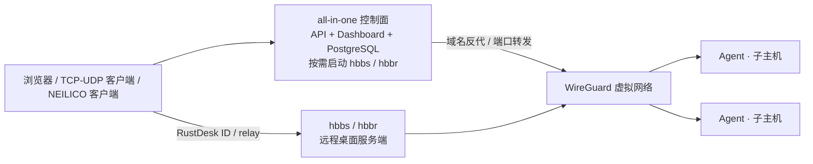

[English](README.md) | **简体中文**

# NEILICO

NEILICO 是一套自托管的内网穿透、Mesh 组网、域名反向代理、TCP/UDP 端口转发和远程桌面控制面；它把 API、Dashboard、PostgreSQL 与 RustDesk 服务端（`hbbs`/`hbbr`）放进一个 all-in-one 容器，并用子主机 Agent 应用 WireGuard 配置。

它把分散服务的发布入口、虚拟网络、设备、策略、代理与端口转发规则以及远程桌面接入参数集中管理。远程连接本身由 NEILICO 客户端发起，Web 只负责管理。

## 架构



- 控制面单容器提供 API、Dashboard 和 PostgreSQL。控制面按需拉起 `hbbs`/`hbbr`，无远程桌面活动时不监听相关端口。
- Agent 负责接入、心跳和领取版本化配置；在平台支持且权限充足时应用 `wg0`、路由和子网转发。
- 域名反代处理 HTTP/HTTPS，端口转发规则发布显式 TCP/UDP 端口；两者都将目标解析到节点虚拟 IP 或指定地址。
- RustDesk 服务端提供 ID/信令与中继。远程连接一律由独立的 [NEILICO client](https://github.com/aceneil/neilico-client) 发起。

## 目录结构

| 路径 | 用途 |
| :-- | :-- |
| `control-plane/` | Go API、认证授权、租户、节点、网络、规则、指标和远程桌面控制 |
| `agent/` | 子主机 Agent、能力探测、WireGuard 应用、路由与转发 |
| `dashboard/` | Vue 3 Dashboard |
| `third_party/rustdesk-server/` | vendored RustDesk Server `hbbs`/`hbbr`（AGPL-3.0） |
| `deploy/` | all-in-one、Agent、Compose 和 Helm 部署文件 |
| [`docs/`](docs/README.md) | 规格、接入、运维、远程桌面和网络边界文档 |
| `cli/` | `neilicoctl` 命令行 |
| `scripts/` | 冒烟、TLS、验证和运维脚本 |

Flutter 设备管理端（原 `desktop/`）和 `rust-core/` 骨架已迁移到 [aceneil/neilico-client](https://github.com/aceneil/neilico-client) 的 [`app/`](https://github.com/aceneil/neilico-client/tree/neilico/app)。旧目录暂时保留，以便迁移过渡。

## 快速开始

使用参考 Compose 文件 [`deploy/allinone/docker-compose.yml`](deploy/allinone/docker-compose.yml) 和环境变量模板 [`deploy/allinone/.env.example`](deploy/allinone/.env.example)。启动前把 Compose 的 `env_file` 和持久卷指向你选定的数据目录。

```bash
cd deploy/allinone
cp .env.example <your-data-root>/neilico.env
# 生成并替换 POSTGRES_PASSWORD、NEILICO_AUTH_JWT_SECRET、
# NEILICO_BOOTSTRAP_ADMIN_EMAIL 和 NEILICO_BOOTSTRAP_ADMIN_PASSWORD。
chmod 600 <your-data-root>/neilico.env
docker compose up -d --build
curl -fsS http://127.0.0.1:13000/healthz
```

访问 `http://127.0.0.1:13000/` 使用 Dashboard 和 API。内置反代默认监听 `18081`。

首次登录有两种方式：配置 `NEILICO_BOOTSTRAP_ADMIN_*`；或者不配置它们，在登录页使用「首次使用？注册」。注册表单会请求 `GET /api/v1/setup/status`，`registration_open=true` 时首个账号成为平台管理员并自动登录；系统已有账号后再次注册会返回 `409 already_initialized`。bootstrap 密码必须至少 16 个字符，并包含四类字符中的至少三类。

## 子主机接入

在 Dashboard 创建一次性 enroll token，然后使用 Linux/macOS 或 Windows 安装器：

```bash
curl -fsSL https://<SERVER>/install.sh | sudo bash -s -- --token <TOKEN>
```

```powershell
powershell -ExecutionPolicy Bypass -Command "& ([scriptblock]::Create((irm https://<SERVER>/install.ps1))) -Token <TOKEN>"
```

安装脚本会下载对应架构的 Agent、校验 SHA-256、安装服务并保存一次性凭据；还支持 `--name`、`--server` 和 `--dry-run`。Docker Agent 可以直接运行，也可以使用 [`deploy/agent/README.md`](deploy/agent/README.md) 中的 Compose 示例：

```bash
docker run -d --network host --cap-add NET_ADMIN --device /dev/net/tun \
  -v neilico-agent-state:/var/lib/neilico-agent \
  -e NEILICO_TOKEN=<TOKEN> ghcr.io/aceneil/neilico-agent:latest
```

真实 WireGuard 需要 `NET_ADMIN` 或等价管理员权限、`/dev/net/tun` 以及内核或系统 WireGuard 支持。缺少任一项时，Agent 会如实把 `mesh`、`subnet_routes` 或 `tunnel` 上报为不可用，不会伪造已连通。

## 远程桌面

RustDesk `hbbs`（ID/信令）和 `hbbr`（中继）已编译进 all-in-one 镜像，由控制面按需启动。默认 `on_demand` 模式只在有活动时启动，并在空闲超过 `NEILICO_RD_IDLE_TIMEOUT` 后回收；也支持 `always_on` 和 `off`。端口为 `21115-21119`，其中 `21116` 同时使用 TCP/UDP；服务未启用时不监听是正常的。

`hbbr` 启动时使用 `-k _` 做 RustDesk 协议 Key 校验，但这不是 NEILICO 账号/设备白名单。ID/中继入口默认接受任何能够到达服务端的客户端注册，公网部署必须自行限制暴露面和访问来源。加密由 RustDesk 协议负责。Web 只管理设备与策略，不提供连接入口。独立客户端的下载方式和平台状态见 [aceneil/neilico-client](https://github.com/aceneil/neilico-client)。

## 配置速查

| 变量 | 作用 |
| :-- | :-- |
| `POSTGRES_PASSWORD`、`NEILICO_AUTH_JWT_SECRET` | 数据库和 JWT 必填秘密；只放在受保护的 env 文件中 |
| `NEILICO_BOOTSTRAP_ADMIN_EMAIL` / `_PASSWORD` | 首个管理员；两者都未配置时走首次注册 |
| `NEILICO_SERVER_PORT` | 控制面 API/Dashboard 端口；Compose 映射为 `13000` |
| `NEILICO_PROXY_LISTEN` | 内置反代监听；Compose 映射为 `18081` |
| `NEILICO_RD_ENABLED`、`NEILICO_RD_ID_SERVER`、`NEILICO_RD_RELAY_SERVER` | 远程桌面总开关和下发地址 |
| `NEILICO_RD_SERVER_MODE`、`NEILICO_RD_IDLE_TIMEOUT` | `on_demand`/`always_on`/`off` 生命周期和空闲回收 |
| `NEILICO_RD_KEY_DIR`、`NEILICO_RD_PUBLIC_KEY_FILE` | 服务端密钥目录和只读公钥路径；私钥不离开密钥目录 |
| `NEILICO_RD_PORTS`、`NEILICO_RD_RELAY_PORT`、`NEILICO_RD_UDP_PORT` | hbbs/hbbr 监听与探活端口 |
| `NEILICO_RD_RELAY_HOST` | 传给 `hbbs -r` 的显式中继主机 |
| `RUSTDESK_RELAY_HOST` | 公网部署/客户端侧使用的中继主机名；控制面实际读取 `NEILICO_RD_RELAY_HOST`，自动化时需映射两个名称 |
| `NEILICO_DOWNLOADS_DIR` | `/downloads/...`、`install.sh` 和 `install.ps1` 使用的产物目录 |
| `NEILICO_STREAM_PORT_MIN` / `_MAX` | 端口转发规则允许发布的 TCP/UDP 端口区间 |

## 文档入口

从双语 [文档索引](docs/README.md) 开始。主要参考包括 [Control API](docs/API.md)、[Agent 接入](docs/AGENT_ENROLL.md)、[运维手册](docs/OPS.md)、[远程桌面集成](docs/REMOTE_DESKTOP.md)、[公网部署清单](docs/DEPLOY_PUBLIC.md) 和 [NEILICONET 可行性分析](docs/NEILICONET.md)。

## 诚实限制

- 控制面 TLS/mTLS 默认关闭，默认 LAN 访问是明文 HTTP。启用 TLS/mTLS 前阅读 [`docs/OPS.md`](docs/OPS.md)；公网入口必须自行终止 TLS 或显式开启。
- 当前没有自带 P2P 打洞。NAT 两端都不可达时，WireGuard 建不起来。边界、端口转发和可达性条件见 [`docs/NEILICONET.md`](docs/NEILICONET.md) 与 [`docs/DEPLOY_PUBLIC.md`](docs/DEPLOY_PUBLIC.md)。
- `/metrics` 没有接入 `neilico_p2p_success_rate` 或 `neilico_relay_bytes` 的真实采集，两者恒为 `0`。
- Agent 能力会按平台支持和权限如实降级；Windows/macOS 的完整 Mesh 能力必须以运行时探测结果为准。
- `third_party/rustdesk-server` 是 **AGPL-3.0**，原文见 [`third_party/rustdesk-server/LICENSE`](third_party/rustdesk-server/LICENSE)。

## 许可

根目录 [`LICENSE`](LICENSE) 仍为占位文件，**主仓库许可待定**。本 README 不替所有者选择许可。第三方 RustDesk Server 源码及 vendored Cargo 依赖保留各自许可，见 [`NOTICE`](NOTICE) 和 `third_party/rustdesk-server/`。
