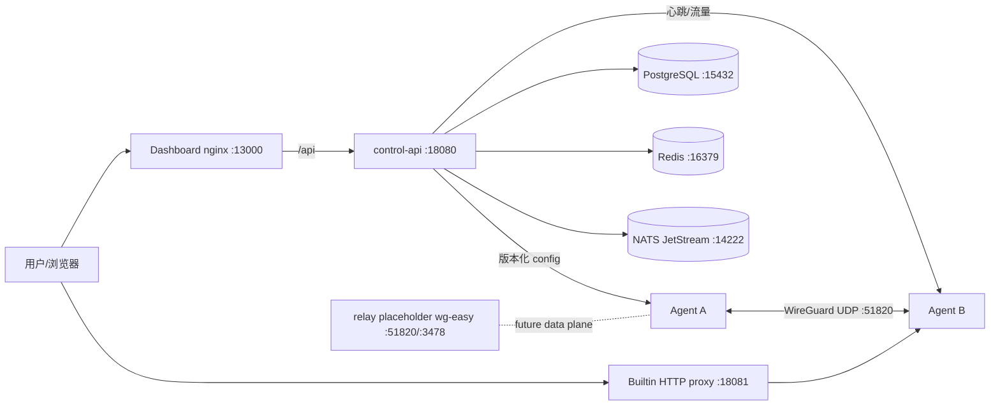

# UMPP 运维手册

## 架构



M2b 当前只生成 WireGuard 配置和维护 relay 元数据；Compose 的 `relay` 是 wg-easy 占位容器，不是 UMPP 自研中继协议实现。3478/udp 为未来 TURN/ICE 预留。

## 端口表

| 组件 | 容器端口 | 默认宿主端口 | 用途 |
| :--- | :---: | :---: | :--- |
| control-api | 8080/tcp | 18080/tcp | REST API、healthz、metrics |
| control-api builtin proxy | 8081/tcp | 18081/tcp | Host-based HTTP 反代 |
| dashboard | 8080/tcp | 13000/tcp | nginx 静态资源 + /api 反代 |
| postgres | 5432/tcp | 15432/tcp | GORM 数据库 |
| redis | 6379/tcp | 16379/tcp | 预留缓存/队列 |
| nats | 4222/tcp | 14222/tcp | JetStream |
| relay placeholder | 51820/udp | 51820/udp | WireGuard 占位 |
| relay placeholder | 3478/udp | 3478/udp | TURN 预留 |

生产环境只暴露 Dashboard/API/代理和必要 UDP，数据库、Redis、NATS 应绑定内网或私有 Docker network。

## 备份与恢复

```bash
cd deploy/docker-compose
docker compose exec -T postgres pg_isready -U umpp -d umpp
docker compose exec -T postgres pg_dump -U umpp -d umpp --format=custom > umpp-$(date +%Y%m%d-%H%M).dump
# 恢复到空数据库：
docker compose exec -T postgres pg_restore -U umpp -d umpp --clean --if-exists < umpp-YYYYmmdd-HHMM.dump
```

同时备份 `.env`（放入 secrets manager，不要提交仓库）、TLS 证书和 Agent `state.json`。恢复后重建控制面：`docker compose up -d --build`，再检查 `/healthz`、`/metrics` 和审计日志。

## 升级流程

1. 阅读 release notes，备份 PostgreSQL 和 `.env`。
2. 在测试环境执行 `docker compose config -q && bash scripts/smoke.sh`。
3. 拉取新镜像/代码，运行 `docker compose build --pull`。
4. `docker compose up -d`，观察 `docker compose ps`、控制面日志、`umpp_nodes_online`。
5. 任一节点配置版本异常时使用 `POST /api/v1/configs/{target_type}/{target_id}/rollback` 回滚到已知版本。
6. 回滚使用上一步备份的 dump 和镜像 tag；不要删除 pgdata，除非确认恢复成功。

## 监控指标与告警阈值

| 指标 | 阈值/建议 |
| :--- | :--- |
| `umpp_nodes_online` | 与设备基线比较，下降即告警 |
| 节点离线 | 超过 5 分钟告警（Agent 心跳超时 60 秒） |
| `umpp_tunnel_up` | 任一关键网络节点连续 2 分钟为 0 |
| `umpp_p2p_success_rate` | < 60% 告警 |
| `umpp_relay_bytes` | 5 分钟内超过基线 3σ 或持续增长 |
| `umpp_proxy_requests` | 5xx 比例 > 1% 或请求量突增 |
| `umpp_config_version` | 配置下发失败、版本停滞超过 5 分钟 |
| `umpp_agent_heartbeat_latency` | p95 > 5 秒 |
| 证书 `expires_at` | 30 天内过期 |

Prometheus 抓取 `GET :18080/metrics`；Agent 指标默认 `127.0.0.1:9100`，只在需要时通过内网采集。

## 日志

- 控制面：`docker compose logs -f control-api`，JSON 输出 stdout，json-file driver 限制 10m × 3。
- Dashboard/nginx：`docker compose logs -f dashboard`。
- PostgreSQL/Redis/NATS：`docker compose logs -f postgres redis nats`。
- Agent：stdout + journald；`state.json` 为敏感文件权限 0600。
- 审计：PostgreSQL `audit_logs`，通过 `GET /api/v1/audit-logs` 查询。
- 代理访问日志：MVP 记录到控制面 stdout/指标，ClickHouse 集成为 V1。

## 故障排查清单

### 容器不健康

```bash
docker compose ps
docker compose logs --tail=50 control-api postgres
curl -fsS http://127.0.0.1:18080/healthz
docker compose exec postgres pg_isready -U umpp -d umpp
```

常见原因：`.env` 占位符未替换、Postgres 密码不一致、端口被占用、`UMPP_DATABASE_DSN` 字段写错。

### 节点不上线

检查 Agent 日志、`state.json` 权限、API 网络可达性、UDP 51820、系统时间。连续 60 秒无心跳会标记 offline。

### 代理 502

检查域名 active、proxy rule enabled、node virtual IP、目标端口、从 control-api 容器到目标的连通性，以及 `control-api` 中 `builtin proxy request failed`。

### 证书过期

查看 `certificates` 的 `expires_at`，重新导入匹配的 cert/key，绑定域名并观察 `domains.status`。客户端需要信任新证书链；必要时回滚旧证书。

### 磁盘/日志增长

确认 json-file `max-size=10m`、`max-file=3`，归档并清理旧 `pg_dump`，监控 Docker 磁盘水位。
