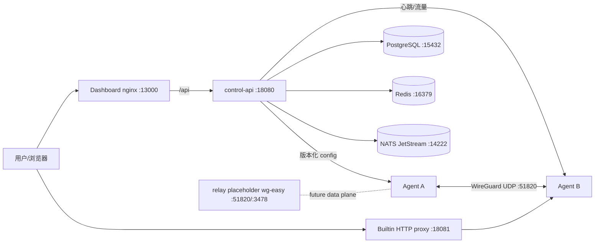

# UMPP 运维手册

## 架构



M2b 当前只生成 WireGuard 配置和维护 relay 元数据；Compose 的 `relay` 是 wg-easy 占位容器，不是 UMPP 自研中继协议实现。3478/udp 为未来 TURN/ICE 预留。

## 端口表

| 组件 | 容器端口 | 默认宿主端口 | 用途 |
| :--- | :---: | :---: | :--- |
| control-api | 8080/tcp | 18080/tcp | REST API、healthz、metrics |
| control-api builtin proxy | 8081/tcp | 18081/tcp | Host-based HTTP 反代 |
| control-api builtin TLS | 8443/tcp | 18443/tcp（ACME overlay） | SNI TLS 终结 |
| control-api HTTP-01 | 80/tcp（生产默认） | 18082->5002/tcp（Pebble overlay） | ACME 挑战专用 listener |
| Pebble ACME directory | 14000/tcp | 14000/tcp（测试 overlay） | RFC 8555 目录 |
| Pebble management | 15000/tcp | 8055/tcp（测试 overlay） | `/roots/0` 等管理端点 |
| dashboard | 8080/tcp | 13000/tcp | nginx 静态资源 + /api 反代 |
| postgres | 5432/tcp | 15432/tcp | GORM 数据库 |
| redis | 6379/tcp | 16379/tcp | 预留缓存/队列 |
| nats | 4222/tcp | 14222/tcp | JetStream |
| relay placeholder | 51820/udp | 51820/udp | WireGuard 占位 |
| relay placeholder | 3478/udp | 3478/udp | TURN 预留 |

生产环境只暴露 Dashboard/API/代理和必要 UDP，数据库、Redis、NATS 应绑定内网或私有 Docker network。

## 备份与恢复

```bash
cd deploy/docker-compose
docker compose exec -T postgres pg_isready -U umpp -d umpp
docker compose exec -T postgres pg_dump -U umpp -d umpp --format=custom > umpp-$(date +%Y%m%d-%H%M).dump
# 恢复到空数据库：
docker compose exec -T postgres pg_restore -U umpp -d umpp --clean --if-exists < umpp-YYYYmmdd-HHMM.dump
```

同时备份 `.env`（放入 secrets manager，不要提交仓库）、TLS 证书和 Agent `state.json`。恢复后重建控制面：`docker compose up -d --build`，再检查 `/healthz`、`/metrics` 和审计日志。

## 升级流程

1. 阅读 release notes，备份 PostgreSQL 和 `.env`。
2. 在测试环境执行 `docker compose config -q && bash scripts/smoke.sh`。
3. 拉取新镜像/代码，运行 `docker compose build --pull`。
4. `docker compose up -d`，观察 `docker compose ps`、控制面日志、`umpp_nodes_online`。
5. 任一节点配置版本异常时使用 `POST /api/v1/configs/{target_type}/{target_id}/rollback` 回滚到已知版本。
6. 回滚使用上一步备份的 dump 和镜像 tag；不要删除 pgdata，除非确认恢复成功。

## V1-R2 告警规则

评估器随 `cmd/api` 启动，默认每分钟扫描全部租户；context 取消时停止。`POST /api/v1/alerts/evaluate` 可手工触发。规则和阈值只读查询：`GET /api/v1/alerts/rules`。

| 规则 ID | 生效条件 | 默认阈值 | 严重级 | 当前数据源 | 配置覆盖键 |
| :--- | :--- | :--- | :--- | :--- | :--- |
| `node_offline` | `now - node.last_seen` **大于**阈值 | 5 分钟 | `warning` | `nodes.last_seen` | `alerts.node_offline_after` / `UMPP_ALERTS_NODE_OFFLINE_AFTER` |
| `certificate_expiring` | `status=active` 且 `expires_at - now` **小于**阈值 | 30 天；剩余 **≤7 天** 为 `critical` | `warning/critical` | `certificates.expires_at/status` | `alerts.certificate_expiring_in`、`alerts.certificate_critical_in` |
| `p2p_success_rate_low` | P2P 成功率 `< 60%` | 60% | `warning` | **未接入**，返回 `data_status=insufficient_data`，不生成假告警 | `alerts.p2p_success_rate_minimum` |
| `relay_traffic_spike` | 当前中继流量 `>= 24h 均值 × 3` | 3 倍 | `warning` | **未接入**，返回 `data_status=insufficient_data`，不生成假告警 | `alerts.relay_spike_multiplier`、`alerts.relay_baseline_window` |
| `config_dispatch_failed` | 配置交付失败，或证书 `status=failed` / `last_error != ""` | 立即 | `critical`（失败交付）/ `warning`（active 证书续期错误） | `config_dispatch_failures`、`certificates.last_error/status` | 无阈值 |

边界按规格文字实现：节点恰好 5 分钟不触发、超过才触发；证书恰好 30 天不触发、小于才触发；P2P 恰好 60% 不触发；中继恰好 3 倍触发。

### 状态机与持久化

- 新条件触发写 `alerts.state=firing` 和一条 `alert_events(state=firing)`。
- 同一 `(tenant,rule,target_type,target_id)` 的当前 firing 唯一。持续评估只刷新 `since/value/last_evaluated_at`，不重复写事件；`started_at` 保持首次触发时间，Dashboard 的持续时长使用它。
- 条件消失写 `state=resolved`、`resolved_at` 和一条 resolved 事件。再触发复用当前记录并重置 `started_at`，形成完整时间线。
- resolved 当前行默认保留 7 天（`alerts.resolved_retention`），支持「当前 firing」「最近 resolved」「目标历史」查询。
- 无数据源规则用 `data_status=insufficient_data` 明示；该结果不落库、不通知、不计入 firing。

### 通知

默认 `log`，向 stdout 写结构化日志。配置 `alerts.webhook_url` 后同时 POST JSON；单次超时默认 5 秒，失败最多重试 3 次（共最多 4 次请求），最终失败只记日志，不影响评估/API 主流程。不提供邮件或短信。

```json
{
  "event": "alert.firing",
  "schema_version": "umpp.alert.v1",
  "alert": {
    "id": "<uuid>",
    "rule": "node_offline",
    "severity": "warning",
    "target_type": "node",
    "target_id": "<uuid>",
    "title": "节点离线",
    "detail": "...",
    "value": 601.2,
    "threshold": 300,
    "since": "2026-10-02T12:00:00Z",
    "state": "firing",
    "started_at": "2026-10-02T12:00:00Z"
  },
  "timestamp": "2026-10-02T12:00:01Z"
}
```

## V1-R2 指标与数据来源

Prometheus 抓取 `GET :18080/metrics`。**无采集来源的指标保持 0，不模拟增长；待 V2 接入真实采集。**

| 指标 | 类型/标签 | V1-R2 数据来源 |
| :--- | :--- | :--- |
| `umpp_nodes_online` | gauge | PostgreSQL `nodes.status=online` 实时计数 |
| `umpp_tunnel_up{network_id,node_id}` | gauge | 由 network member + node online 状态推导；不是 UDP 遥测 |
| `umpp_p2p_success_rate` | gauge | **数据源未接入，当前恒为 0；V2 接入真实采集** |
| `umpp_relay_bytes` | gauge | **中继吞吐数据源未接入，当前恒为 0；V2 接入真实采集** |
| `umpp_proxy_requests` | gauge | 内置反代真实请求计数；标签明细另有 `umpp_proxy_requests_total{domain,status}` |
| `umpp_config_version{target_type,target_id}` | gauge | `config_versions` 每目标最新版本 |
| `umpp_agent_heartbeat_latency` | gauge | 当前只记录 heartbeat 成功时间，没有请求耗时样本；**恒为 0，V2 接入真实采集** |
| `umpp_alerts_firing{severity,rule}` | gauge | `alerts.state=firing` 实时计数，所有已知组合均暴露 |

原有 ACME、TLS、证书到期和 HTTP 指标继续保留。空数据集的 `_none` 样本仅为保证 metric family 存在，数值为 0，不代表真实目标。

## ACME 自动续期处置

- 调度器每 `acme.check_interval` 扫描 `issuer=acme`、`auto_renew=true`、`status=active` 且进入 `renew_before_days` 的证书。
- 续期失败只写 `last_error`、递增失败计数和 `next_attempt_at`，`status` 保持 `active`；指数退避从 30 分钟开始，最长 24 小时。
- 成功后原子更新 `cert_pem`/`expires_at`/`renewed_at`/`renew_count`，失效内置代理证书缓存，并递增引用证书的 proxy/node 配置版本。
- 手工 `POST /api/v1/certificates/{id}/renew` 不等待退避窗口；同一证书已有 order 时返回 `409 order_in_flight`。
- `revoke` 路由当前返回 `501 acme_revoke_not_implemented`。删除被 domain 引用的证书返回 `409`。

## Pebble 真实 ACME 测试栈

只允许 Pebble/staging，不得用 Let's Encrypt 生产目录做验收。测试 overlay 会启动 Pebble 和一个 **仅提供 DNS A 记录** 的 challenge test DNS 服务；Pebble 仍通过真实 HTTP-01 GET 请求访问 control-api 的挑战响应，`PEBBLE_VA_ALWAYS_VALID=0`，没有使用 always-valid。

```bash
cd deploy/docker-compose
docker compose -f docker-compose.yml -f docker-compose.acme.yml config -q
cd ../..
bash scripts/smoke-acme.sh
```

测试端口：API 18080、HTTP 反代 18081、TLS 18443、HTTP-01 18082、Pebble directory 14000、Pebble management 8055。`scripts/smoke-acme.sh` 会执行真实签发、Pebble 链验证、SNI 指纹比对和二次 order 续期，并在失败时打印全部容器日志尾 50 行。overlay 中 `UMPP_ACME_CA_CERT_FILE=/pebble-certs/pebble.minica.pem` 用于信任 Pebble 的目录 TLS；链验证使用 management API 的 `/roots/0` 签发根。

## 日志

- 控制面：`docker compose logs -f control-api`，JSON 输出 stdout，json-file driver 限制 10m × 3。
- Dashboard/nginx：`docker compose logs -f dashboard`。
- PostgreSQL/Redis/NATS：`docker compose logs -f postgres redis nats`。
- Agent：stdout + journald；`state.json` 为敏感文件权限 0600。
- 审计：PostgreSQL `audit_logs`，通过 `GET /api/v1/audit-logs` 查询。
- 代理访问日志：MVP 记录到控制面 stdout/指标，ClickHouse 集成为 V1。

## 故障排查清单

### 容器不健康

```bash
docker compose ps
docker compose logs --tail=50 control-api postgres
curl -fsS http://127.0.0.1:18080/healthz
docker compose exec postgres pg_isready -U umpp -d umpp
```

常见原因：`.env` 占位符未替换、Postgres 密码不一致、端口被占用、`UMPP_DATABASE_DSN` 字段写错。

### 节点不上线

检查 Agent 日志、`state.json` 权限、API 网络可达性、UDP 51820、系统时间。连续 60 秒无心跳会标记 offline。

### 代理 502

检查域名 active、proxy rule enabled、node virtual IP、目标端口、从 control-api 容器到目标的连通性，以及 `control-api` 中 `builtin proxy request failed`。

### 证书过期/续期失败

先看 `GET /api/v1/certificates/{id}` 的 `status/last_error/next_attempt_at` 和 `/metrics` 的 expiry/order/renewal 指标。DNS、公网 80、CA 信任或挑战端口异常时修复后手工 `/renew`；不要因一次续期失败删除当前 active 证书。手工证书仍可重新导入匹配 cert/key 并绑定域名，客户端需要信任新证书链。

### 磁盘/日志增长

确认 json-file `max-size=10m`、`max-file=3`，归档并清理旧 `pg_dump`，监控 Docker 磁盘水位。
